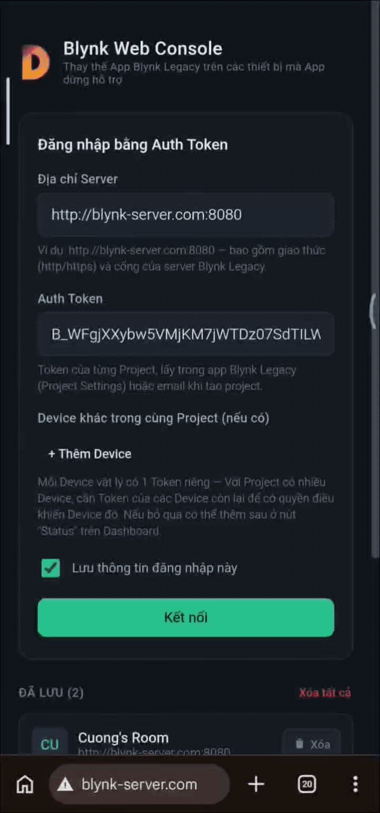

# Blynk Web Console

A lightweight, self-hosted web dashboard for **Blynk Legacy** IoT projects — a drop-in replacement for the official Blynk Legacy mobile app, which has been pulled from the App Store and Google Play.

No build step. No framework. No external CDN calls. Just static files you can drop on any web server and open in a browser.



## Why this exists

Blynk Legacy's official mobile app was discontinued, leaving self-hosted Blynk Legacy servers with no first-party client. This project re-implements a Blynk Legacy **dashboard client** entirely in the browser — talking directly to your Blynk Legacy server over its real binary WebSocket protocol (`login`, `bridge`, `ping`, `hwSync`, `hardware`), the same protocol the original app and physical devices use. No polling, real-time updates.

## Features

- **Real-time control** over the native Blynk Legacy binary WebSocket protocol — not HTTP polling.
- **Pixel-accurate widget layout**, following the same grid formula as the original app (`left = x*60`, `top = y*70`, …), so projects look the same as they did in the mobile app.
- **Wide widget support**: buttons, sliders, joystick, RGB picker, gauges, LED, LCD, level displays, step controls, numeric displays, menu, segmented control, text/number input, table, map, image, terminal, time input, timer, RTC clock, eventor summary, device selector, and a full historical chart widget.
- **Historical charts**: gzip-compressed CSV history decoding, pan & zoom, and time-range presets read directly from each chart's own configuration (`15min`, `1h`, `1d`, `1wk`, `1Mo`, …) instead of a hardcoded list.
- **Correct multi-field pin protocols**: `TIME_INPUT` and `TIMER` values are NUL-separated multi-field payloads on the wire (not simple strings) — this client decodes and re-encodes them correctly, including timezone conversion sourced from the project's own RTC widget.
- **Multi-device projects done right**: each physical board has its own hardware token; this console lets you assign/edit/clear a token per board (never silently guesses or reuses the wrong one), shows live per-board connection status, and visibly flags widgets that belong to a board with no token assigned yet.
- **Quick-connect via link or QR code**: generate a link (and a self-rendered QR code — no external QR service) that carries your server address and every saved device token, so logging in on a new device/phone takes one scan instead of retyping long tokens.
- **Optional browser-sensor widgets**: GPS Streaming (Geolocation API) and Accelerometer/Gravity (DeviceMotion API) work using the browser's own sensors when available, and fail gracefully (with a clear message) when they're not.
- **Configurable auto-sync interval**, mobile-first dark UI, and a fully static deployment (just point Nginx/Apache/Caddy at the folder).
- 


## What this is *not*

- **Not an account/cloud service.** It talks to *your own* self-hosted Blynk Legacy server using hardware tokens you already have — there's no separate backend, database, or user system.
- **Not a project editor.** It renders and controls an existing project exactly as configured; it can't add/remove/reposition widgets or edit a project's structure (that still requires the original Blynk app/project tooling). A few settings backed by widget *configuration* rather than pin values (e.g. a Timer's scheduled start/stop time) are display-only for the same reason — editing them needs the server's project-management API, which isn't reachable with a plain hardware token.
- **Not a way to run two masters on one token.** Blynk Legacy hardware tokens are a single identity to the server — if your physical device and this console are both logged in with the same token, most Blynk servers will only keep one connection alive. Don't leave the console open 24/7 alongside a live device on the same token; use it for active sessions.

## Getting started

1. Download or clone this repository.
2. Serve the folder with any static file server — for example:
   ```bash
   npx serve .
   # or
   python3 -m http.server 8080
   ```
3. Open the page, enter your Blynk Legacy server address and a device's hardware auth token, and connect.

## Project structure

```
index.html   markup; loads style.css + the JS files below
style.css    all styling (mobile-first, dark theme)
app.js       utilities, localStorage helpers, server address parsing,
             REST API calls, BlynkWSClient (the binary WebSocket protocol)
widgets.js   one renderer per widget type
ui.js        app state, login screen, dashboard screen, bootstrap
qrcode.js    self-contained QR code encoder (no dependency, no CDN)
favicon.ico  browser tab icon
logo.png     logo shown on the login screen
```

No build tooling, no `node_modules`, no bundler — edit a file, refresh the page.

## Browser support

Modern evergreen browsers (Chrome, Edge, Firefox, Safari) on desktop and mobile. Some optional features degrade gracefully rather than breaking:
- Clipboard copy falls back to a legacy method on insecure (non-HTTPS, non-`localhost`) origins, where the modern Clipboard API isn't available.
- GPS Streaming and Accelerometer/Gravity widgets require a secure context and, on iOS, an explicit permission tap; where unsupported, they show a clear "not available" message instead of failing silently.

## Contributing

Issues and pull requests are welcome — especially real-world testing against different self-hosted Blynk Legacy server variants, since protocol edge cases (like the multi-field `TIME_INPUT`/`TIMER` payload format) were reverse-engineered from real project exports rather than official documentation.

## License

This project is licensed under the MIT License - see the [LICENSE](LICENSE.md) file for details.

## Credits

Developed by [**DIY Everything VN**](https://diyevrything.cc).
